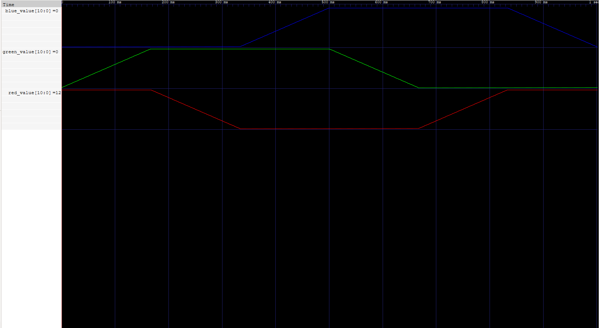

# Miniproject 2 - PWM RGB LED Color Cycle

This project uses SystemVerilog and PWM to cycle the Pico RGB LED through the color wheel once per second.

## Simulation

The following GTKWave plot shows the red, green, and blue duty-cycle values over one complete cycle (1 second).

## Video Demo

[Watch the project running on the iceBlinkPico](https://youtu.be/BPa5eBy0EAg)

## Files Used

- `mp2.sv` - Main SystemVerilog design
- `mp2_tb.sv` - Verilog testbench
- `iceBlinkPico.pcf` - FPGA pin assignments
- `mp2_gtkwave.png` - Simulation results